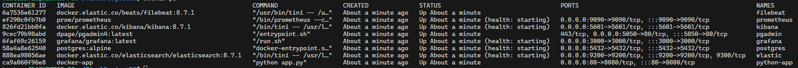
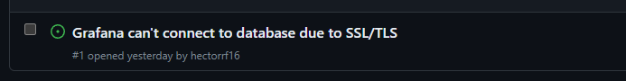

# Final Project Bootcamp DevOps 2023 - GeeksHubs
##### Este es el proyecto final del Bootcamp de DevOps de Héctor Rodríguez Fusté impartido por GeeksHbubs
###### <u>**Nota:** Todas las contraseñas de este repositorio han sido creadas específicamente para este proyecto, cualquier coincidencia con otros sistemas es mera casualidad.</u>
----


# Por Hacer
- [X] Aplicación desarrollada en Python
- [X] Sistema de Integración Continua - https://github.com/hectorrf16/FinalProjectDO
- [X] Aplicación totalmente Contenerizada - Imagen en https://hub.docker.com/r/hectorrf16/finalprojectdo
- [X] Orquestador de Contenedores
- [ ] Sistema Automatizado de Despliegue con Github Actions
- [ ] Sistema de Monitorización
- [ ] Sistema de Recogida de información de Contenedores con Prometheus
- [X] Sistema de Exposición de información de Contenedores en Grafana

# Posibles Mejoras
- [ ] Despliegue de Infra en Cloud
- [ ] Diseñar Infra y aplicar en Diagrama
- [ ] Creación y Aprovisionamiento de la Infra
- [ ] Creación de Tests de estrés
- [ ] Analisis perfomance de la Infra

# Diseño infraestructura
<!--  This should be uncomment when project is finished -->


# Memoria
## **APLICACIÓN** 

Este proyecto final va a ser el principio de una idea que tengo en mente.

La idea es tener una herramienta para mi mujer, pero que no influya de donde acceda, por lo que no quiero tener una app compilada directamente en una tecnologia (Android / iOS), que sea multiplataforma, que no tenga que pasar por ninguna store con sus procesos de aprobacion.

El problema que ha surgido, para presentar el proyecto, es la falta de tiempo... por lo que he tenido que hacer un MockUp en Python para tener "algo" que mostrar visualmente y asi desarrollar la infraestructura necesaria para el projecto, pero la idea final para mi propio proyecto, seria modificar dicho Python y portarlo a Vue.js como backend e [Ionic](https://ionicframework.com) como frontend.

La aplicacion va a ser desarrollada en docker para poder aplicarla en local, por la facilidad de creacion de contenedores, o por que ya tengo un background con docker y me es super facil de aplicar la idea sin "perder" tiempo en aprender, ya que ese tiempo me gustaria implementarlo, en por ejemplo, aprender K8s, AWS etc... que es lo nuevo que he aprendido aqui.

Tambien habra un apartado para poder implementar toda la infraestructura en cloud, por lo que al inicio podras especificar que quieres, si instalacion en local o instalacion en cloud. Tambien voy a implementar un metodo de "recuperacion" del sistema por si en un futuro hacemos una modificacion de algo y queremos hacer rollback a un estado que funcione, sin tener que voler a hacer pull del repo.

Para la instalacion en cloud, se va a implementar en Kubernete y en AWS, porque es la forma mas facil de "traducir" la infraestructura de docker y porque tenemos acceso "ilimitado" a AWS para poder levantar y tirar todas las maquinas que queramos.

Aqui teneis la estructura (arbol de carpeta) del proyecto al final de todo el proceso.

```
"FinalProjectDO"
├── "docker"
│   ├── "grafana"
│   │   ├── "grafana.ini"
│   │   └── "provisioning"
│   │       ├── "datasources"
│   │       │   ├── "datasource.yml"
│   │       │   └── "dashboards"
│   │       │       └── "home.json"
│   │       └── "dashboards.yml"
│   ├── "runs"
│   │   ├── "psrun.sh"
│   │   ├── "pgrun.sh"
│   │   └── "grafanarun.sh"
│   ├── "database"
│   │   ├── "psrun.sh"
│   │   ├── "server.csr"
│   │   ├── "server.key"
│   │   ├── "query.sql"
│   │   ├── "pgadmin"
│   │   │   ├── "pgpass"
│   │   │   └── "servers.json"
│   │   ├── "postgresql.conf"
│   │   └── "server.crt"
│   ├── "docker-compose.yml"
│   └── "app"
│       ├── "app.py"
│       ├── "views"
│       │   └── "home.tpl"
│       ├── "static"
│       │   ├── "css"
│       │   │   ├── "materialize.css"
│       │   │   └── "materialize.min.css"
│       │   └── "js"
│       │       ├── "materialize.min.js"
│       │       └── "materialize.js"
│       └── "requirements.txt"
├── "Proyecto Final Bootcamp DevOps.pdf"
├── "LICENSE"
├── "README.md"
├── "run.sh"
└── "screenshots"
    ├── "grafanaissue1.png"
    ├── "scriptmenu2.png"
    ├── "dockerhub.png"
    ├── "scriptmenu.png"
    ├── "dockerimages.png"
    ├── "grafanaissue1-fix.png"
    ├── "repairmenu.png"
    └── "dockerlist.png"

14 directories, 35 files
```

## **CONTAINER**
Como no se como va a acabar el proyecto, la primera idea es de tener 5 contenedores, y si por alguna razón he de añadir mas, ya seria como complemento de alguna utilidad
- Contenedor con Python para tener una web y poder mostrar la información / datos
- Contenedor con una base de datos Postgresql para almacenar los datos a mostrar en la web
- Contenedor con PgAdmin4 para poder modificar la base de datos de forma visual a traves de una web para no tener que estar haciendo siempre queries sql (para testing o rapidos workarounds)
- Contenedor para el sistema de Monitorización en Grafana
- Contenedor para hospedar el servicio de Jenkins
  
Aqui teneis imagen para mostrar un poco de informacion de como estan trabajando los contenedores
<!--  -->


Para empezar la creacion de los contenedores, solo tenemos que ejecutar el `run.sh` de la raiz del repositorio, el mismo empezara a crear todo lo necesario para poder tener en un par de segundos los contenedores corriendo. El propio script de inicializacion tiene un menu para poder elegir que hacer, es decir, con el mismo script podremos aplicar cambios para tenerlo en local, para tener la infraestructura en el cloud.

Para poder ejecutar la app, dale permisos de ejecucion para el owner, es decir, tu usuario
> sudo chmod 744 ./run.sh

Una vez ejecutado el script (`$ sh ./run.sh`), este sera el menu que vereis y que podreis interactuar


<!--  -->

1. Menu para acceder al menu de instalación en local con docker.  
2. Menu para acceder al menu de instalación en cloud con AWS y Kubernetes.


<!--  -->

1. Menu para elegir la instalación en local.  
2. Menu para elegir iniciar la instalación en local.  
3. Menu para elegir reparar la instancia en local.  

<!--  -->
1. Menu para elegir desinstalar la instancia en local.  
2. Menu para elegir la subida de todas las imagenes en local en un repo en Docker con formato 'nombreusuario'/'nombrerepor':'nombreservicio'.  

 <!--  -->

 <!--  -->

## **ORQUESTADOR CONTAINERS**
Aqui vamos a tener dos orquestradores de containers. El de instalacion local sera docker-compose y el de cloud sera Kubernetes. He decidido utilizar diferentes por una simpple cosa, kubernetes es mas facil de instalar en cloud, ya que muchos servicios te dan la solucion ya montada y solo tienes que crear los clusters y distribuir, en vez de hacer instalacion en local con minikube o kind, lanzar creacion cluster, hacerla funcionar y de ahi lanzar el deploy de los Pods / containers. Como hago todo desde una maquina en WSL desde win 11, he preferido hacer la configuracion e instalacion lo mas facil y ligera posible.
## **SISTEMA DE DESPLIEGUE**
Antes de empezar a intentar implementar esta seccion, tenia pensado utilizar jenkins, ya que me era conocido, pero no lo habia utilizado tanto hasta ahora.. que al ver como costaba implementarlo y lo dificil que era de replicar la misma configuracion de forma automatica sin "hardcodear" todo... decidi retirarlo e utilizar Github Actions, que era mas facil y no dependia de tener que configurar/montar/lanzar algo.
## **SISTEMA DE MONITORIZACIÓN**
## **SISTEMA DE RECOGIDA Y EXPOSICIÓN DE DATOS**
El sistema de cecogida y exposicion de datos sera Grafana y Prometheus, Grafana para exponer los datos en varios dashboards y Prometheus para obtener los datos de docker y trasportarlos a grafana, para que los exponga.
# **ISSUES**
En este apartado vamos a colocar todos los issues que he tenido y que no he podido arreglar y que se quedan para su investigacion. Todo estara documentado en la pagina de issue en [Github](https://github.com/hectorrf16/FinalProjectDO/issues). Tambien al principio de la memoria se puede ver la etiqueta de la cantidad de Issues que hay, por lo que a medida que el projecto avanza, se iran actualizando.

## **SISTEMA DE EXPOSICION DE DATOS**
> **16.05.2023** - Grafana no es capad de conectar con la base de datos, teniendo un datasource configurado, todo porque coge los datos que le da la gana. La base de datos esta configurada para no utilizar SSL/TLS, pero grafana no es capaz de detectarlo y cuando conecta no es capaz de correr ninguna query por el error de Conexion
> 
> 
> 
> **17.05.2023** - Respuesta / Solución
> 