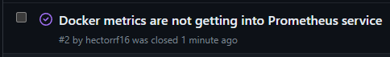

# Final Project Bootcamp DevOps 2023 - GeeksHubs
##### Este es el proyecto final del Bootcamp de DevOps de Héctor Rodríguez Fusté impartido por GeeksHbubs
###### <u>**Nota:** Todas las contraseñas de este repositorio han sido creadas específicamente para este proyecto, cualquier coincidencia con otros sistemas es mera casualidad.</u>
----


# Por Hacer
- [X] Aplicación desarrollada en Python
- [X] Sistema de Integración Continua - https://github.com/hectorrf16/FinalProjectDO
- [X] Aplicación totalmente Contenerizada - Imagen en https://hub.docker.com/r/hectorrf16/finalprojectdo
- [X] Orquestador de Contenedores
- [X] Sistema Automatizado de Despliegue con Github Actions
- [X] Sistema de Monitorización con Elastic / Kibana / FileBeat
- [X] Sistema de Recogida de información de Contenedores con Prometheus
- [X] Sistema de Exposición de información de Contenedores en Grafana

# Posibles Mejoras
- [ ] Despliegue de Infra en Cloud
- [ ] Diseñar Infra y aplicar en Diagrama
- [ ] Creación y Aprovisionamiento de la Infra
- [ ] Creación de Tests de estrés
- [ ] Analisis perfomance de la Infra

# Memoria
## **APLICACIÓN** 

Este proyecto final va a ser el principio de una idea que tengo en mente.

La idea es tener una herramienta para mi mujer, pero que no influya de donde acceda, por lo que no quiero tener una app compilada directamente en una tecnologia (Android / iOS), que sea multiplataforma, que no tenga que pasar por ninguna store con sus procesos de aprobacion.

El problema que ha surgido, para presentar el proyecto, es la falta de tiempo... por lo que he tenido que hacer un MockUp en Python para tener "algo" que mostrar visualmente y asi desarrollar la infraestructura necesaria para el projecto, pero la idea final para mi propio proyecto, seria modificar dicho Python y portarlo a javascript utilizando cualquier libreria tipo _vue.js_ o _react_.

El projecto va a utilizar docker / docker compose como base para los contenedores, lo hago asi porque me gustaria meterle horas a aprender con calma Kubernetes, Jenkins, Github Actions, Prometheus, Elastic, Filebeat etc, ya que docker me es familiar y no necesito tanto tiempo de investigacion y desarrolo

Aqui teneis la estructura (arbol de carpeta) del proyecto al final de todo el proceso.

```
"FinalProjectDO"
├── "docker"
│   ├── "grafana"
│   │   ├── "grafana.ini"
│   │   └── "provisioning"
│   │       ├── "datasources"
│   │       │   ├── "datasource.yml"
│   │       │   └── "dashboards"
│   │       │       ├── "prometheus_stats.json"
│   │       │       └── "home.json"
│   │       └── "dashboards.yml"
│   ├── "runs"
│   │   ├── "psrun.sh"
│   │   ├── "pgrun.sh"
│   │   └── "grafanarun.sh"
│   ├── "database"
│   │   ├── "query.sql"
│   │   ├── "pgadmin"
│   │   │   ├── "pgpass"
│   │   │   └── "servers.json"
│   │   ├── "postgresql.conf"
│   │   └── "logs"
│   ├── "docker-compose.yml"
│   ├── "kibana"
│   │   └── "kibana.yml"
│   ├── "app"
│   │   ├── "app.py"
│   │   ├── "views"
│   │   │   └── "home.tpl"
│   │   ├── "static"
│   │   │   ├── "css"
│   │   │   │   ├── "materialize.css"
│   │   │   │   └── "materialize.min.css"
│   │   │   └── "js"
│   │   │       ├── "materialize.min.js"
│   │   │       └── "materialize.js"
│   │   ├── "requirements.txt"
│   │   └── "logs"
│   ├── "filebeat"
│   │   └── "filebeat.yml"
│   ├── "prometheus"
│   │   └── "prometheus.yml"
│   └── "app-dockerfile"
├── "Proyecto Final Bootcamp DevOps.pdf"
├── "LICENSE"
├── "README.md"
├── "run.sh"
└── "screenshots"
    ├── "docker-elastic.png"
    ├── "grafanaissue1.png"
    ├── "docker-volumes.png"
    ├── "docker-filebeat.png"
    ├── "docker-grafana.png"
    ├── "runhelp.png"
    ├── "docker-app.png"
    ├── "docker-db.png"
    ├── "docker-prometheus.png"
    ├── "docker-pgadmin.png"
    ├── "docker-kibana.png"
    ├── "grafanaissue1-fix.png"
    ├── "dockerlist.png"
    └── "correctrun.png"

19 directories, 42 files
```

## **CONTAINER**
Estos son los siguientes contenedores que vamos a utilizar para poder desarollar el projecto, en teoria todo lo que se haga aqui lo continuare para un projecto personal, por lo que ahora voy a tener la _estructura_ del proyecto sin contenido, para no perder tiempo y poder hace lo maximo posible. En total tenemos 8 contenedores:
- Contenedor con Python para tener una web y poder mostrar la información / datos
- Contenedor con una base de datos Postgresql para almacenar los datos a mostrar en la web
- Contenedor con PgAdmin4 para poder modificar la base de datos de forma visual a traves de una web para no tener que estar haciendo siempre queries sql (para testing o rapidos workarounds)
- Contenedor para hospedar el servicio de monitorizacion con Prometheus
- Contenedor para mostrar la informacion del contenedor de monitorizacion en Grafana
- Contenedores para recolecta de logs con:
    -  Elastic
    -  Kibana
    -  Filebeat
----
Aqui teneis imagen para mostrar un poco de informacion de como estan trabajando los contenedores


Si ejecutamos el fichero `run.sh` con el comando `bash` nos mostrara la informacion para poder iniciar el script correctamente


Y si queremos saber como ejecutarlo de forma correcta, tan solo deberiamos de ejecutar el commando con `--help` como parametro


Si por alguna razon la app no se puede ejecutar, tan solo deberiamos de darle permisos de ejecución a tu usuario sobre el script con el siguiente comando
> sudo chmod u+x ./run.sh

## **¿QUE HACE ESTE SCRIPT?**
Primero, decidi hacer un script de ejecucion porque es bastante mas facil implementar los testeos en un pipeline de forma automatica, solo pasandole la ejecucion del script + parametro en vez de ir metiendo los comandos de docker en cada ejecucion, pero tambien para mi, por mi forma de testear, me es mas rapido escribir menos que tener que escribir todos los comandos de docker por cada intento.

Entonces, como se puede ver en el apartado `--help`, podemos pasarle dos parametros al script y de ahi se ejecutaran unas acciones.

Las opciones son las siguientes:

* 0 - Instalara todos los contenedores y añadira / ejecutara toda la configuracion de cada uno, para tenerlo en funcionamiento tal y como se quiere que esten. Esto va bien por si tenemos que recuperar contenedores, los datos base como conexiones a base de datos y o dashboards de informacion seran persistentes, asi la recuperacion sera casi instantanea
* 1 - Opcion puramente de ejecucion de los contenedores, solo ejecutara un `'docker compose up -d'` y levantara todas las maquinas que no esten ejecutadas en ese momento. Facil por si se ha caido algun contenedor y no queremos "borrar" la configuracion actual, por si queremos leer logs u otras comprobaciones.
* 2 - Podremos reparar un contenedor o todos especificandolo con el segundo parametro del script. La reparacion consiste en borrar todo rasto del contenedor y volviendolo a cargar, por lo que si hemos modificado algo por encima de la configuracion basica, esta se borrara y el/los contenedor/es volveran a su estado base
* 3 - Desinstalacion de todos los contenedores + volumenes, por lo que esto sirve para tener una instalacion limpia en tu equipo, por si los ficheros se han vuelto corruptos a causa de modificaciones por nuestra parte o porque la configuracion ha fallado y no se puede levantar el contenedor
* 4 - Subida de todas las imagenes de los contenedores dentro del fichero _`docker-compose.yml`_ hacia _Docker HUB_ para su guardado por si queremos utilizar dichos contenedores en otros proyectos u otras copias
----


## **ORQUESTADOR DE CONTAINERS**
Para este apartado vamos a utilizar _`'docker compose'`_, porque como bien he dicho antes, estoy bastante familiarizado con docker y esto no me supondra gran problema para avanzar.

Para este proyecto, solo he creado un contenedor manual, es decir, que he hecho un solo build para un contenedor. El resto de contenedores he utilizado las propias imagenes que podemos encontrar en [_Docker Hub_](https://hub.docker.com). Esto lo he hecho asi, porque realmente vamos a tener todos los componentes de los servicios cargados en los contenedores para que se inicien con su propia configuracion ya hecha automaticamente y si tambien tenerlos siempre actualizados cada vez que los _'levantemos'_

La configuracion del fichero es el siguiente

#### **APP**

#### **DB**

#### **PGADMIN**

#### **GRAFANA**

#### **PROMETHEUS**

#### **ELASTIC**

#### **KIBANA**

#### **FILEBEAT**

#### **DOCKER VOLUMES FOR DATA**


----
## **SISTEMA DE DESPLIEGUE**
Antes de empezar a intentar implementar esta seccion, tenia pensado utilizar jenkins, ya que me era conocido, pero no lo habia utilizado tanto hasta ahora.. que al ver como costaba implementarlo y lo dificil que era de replicar la misma configuracion de forma automatica sin "hardcodear" todo... decidi retirarlo e utilizar Github Actions, que era mas facil y no dependia de tener que configurar/montar/lanzar algo.

En este apartado no hay mucho que explicar, solo se aplican varios comandos de testing para que cada vez que se aplique algo en main sea verificado, pero el testing no genera ninguna aplicacion ni compila nada, ya que no creia necesario tener que subir a docker hub una nueva imagen del container a cada iteracion a main, aunque el "build" de los containers no haya cambiado nada. Para el tema de las imagenes en docker ya tenemos una opcion de ejecucion dentro del script base, por lo que no es necesario decirle al servicio CI/CD de hacerlo por el mismo.

----
## **SISTEMA DE MONITORIZACIÓN**
En este caso, hemos instalado la suite de Elastic / Kibana / Filebeat para la recolecion de logs. Es simplemente un lugar para centralizar todos los logs que nos interesen y no tener que estar entrando en cada contenedor para ver que ocurre.

Su configuracion es bastante simple, solo hemos añadido los logs de la base de datos y de la app dentro de nuestro sistema de recoleccion, pero como esta todo el sistema preparado para poder obtener lo que sea, solo se tendria que especificar en cada contenedor que queremos obtener sus logs con la linea `co.elastic.logs/enabled` poniendo un true donde ahora hay un false.

----
## **SISTEMA DE RECOGIDA Y EXPOSICIÓN DE DATOS**
El sistema de recogida y exposicion de datos sera Grafana y Prometheus, Grafana para exponer los datos en varios dashboards y Prometheus para obtener los datos de docker y expornerlos en grafana. Como grafana y prometheus trabajan tan bien juntos, la configuracion de estos es tan simple como crear un container para cada uno, ponerle como conexion (_datasource.yml_) en grafana la direccion de prometheus con su puerto abierto y ya estara, solo nos quedara montar nuestro dashboard con la info recoletada.

En este caso, solo hemos puesto un dashboard principal con toda la informacion que queriamos, como el contenido de una tabla (en nuestro caso la unica) de la base de datos, una recolecion de informacion sobre los items que tenemos, como si fuera nuestro inventario de productos, y luego un trackeo de nuestra infraestructura, para saber si se nos han caido o no los sistemas levantados y la cantidad de recursos consumidos.

----
# **ISSUES**
En este apartado vamos a colocar todos los issues que he tenido y que no he podido arreglar y que se quedan para su investigacion. Todo estara documentado en la pagina de issue en [Github](https://github.com/hectorrf16/FinalProjectDO/issues). Tambien al principio de la memoria se puede ver la etiqueta de la cantidad de Issues que hay, por lo que a medida que el projecto avanza, se iran actualizando.

## **SISTEMA DE EXPOSICION DE DATOS**
> [**16.05.2023 - Ver Problema**](https://github.com/hectorrf16/FinalProjectDO/issues/1) - Grafana no es capaz de conectar con la base de datos, teniendo un datasource configurado, todo porque coge los datos que le da la gana. La base de datos esta configurada para no utilizar SSL/TLS, pero grafana no es capaz de detectarlo y cuando conecta no es capaz de correr ninguna query por el error de Conexion
> 
> 
> 
> **17.05.2023** - Respuesta / Solución
> 

## **SISTEMA DE MONITORIZACION CON PROMETHEUS**
> [**02.06.2023 - Ver Problema**](https://github.com/hectorrf16/FinalProjectDO/issues/2) - Prometheus no era capaz de contactar con el HOST para obtener los datos de metricas de docker, ya que docker estaba en HOST y el propio container no accedia por `_localhost:9393_`
>
> 
> 
> **02.06.2023** - Se activo el servicio de metricas utilizando la direccion ip localhost de docker (`172.22.0.1:9393`) y se añadio la direccion como target en prometheus.
> 

## **SISTEMA DE REGISTRO DE LOGS EN POSTGRESQL**
> [**06.06.2023 - Ver Problema**](https://github.com/hectorrf16/FinalProjectDO/issues/3) - Por alguna razon, toda la informacion que habia en internet no decia como hacer correctamente la activacion de dos variables de postgres para activar los logs. Una de las variables necesitaba reiniciar el servidor de BBDD, pero los comandos que en internet salia no funcionaban... aunque dijera que el servicio estaba reiniciado, no registraba logs. 
>
> 
> 
> **09.06.2023** - Al final, conseguí que registrara todo, añadiendo la informacion requerida sobre el fichero de configuracion y reiniciando el servicio con el comando especifico en el primer setup en un container (`su postgres -c "pg_ctl -U ${POSTGRES_USER} -D /var/lib/postgresql/data -l logfile restart"`)
> 